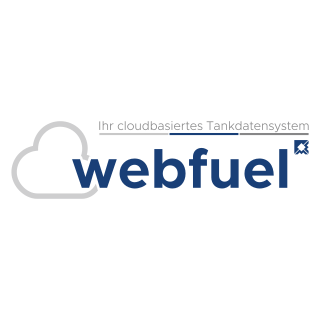

# ioBroker.webfuel-adapter

[](https://www.npmjs.com/package/iobroker.webfuel-adapter)
[](https://www.npmjs.com/package/iobroker.webfuel-adapter)


[](https://nodei.co/npm/iobroker.webfuel-adapter/)

**
Tests:** 

## webfuel-adapter adapter for ioBroker

Zugriff auf das Webfuel.de API

### Publishing the adapter

Using GitHub Actions, you can enable automatic releases on npm whenever you push a new git tag that matches the form
`v<major>.<minor>.<patch>`. We **strongly recommend** that you do. The necessary steps are described
in `.github/workflows/test-and-release.yml`.

Since you installed the release script, you can create a new
release simply by calling:

```bash
npm run release
```

Additional command line options for the release script are explained in the
[release-script documentation](https://github.com/AlCalzone/release-script#command-line).

To get your adapter released in ioBroker, please refer to the documentation
of [ioBroker.repositories](https://github.com/ioBroker/ioBroker.repositories#requirements-for-adapter-to-get-added-to-the-latest-repository)
.

### Test the adapter manually on a local ioBroker installation

In order to install the adapter locally without publishing, the following steps are recommended:

1. Create a tarball from your dev directory:
   ```bash
   npm pack
   ```
1. Upload the resulting file to your ioBroker host
1. Install it locally (The paths are different on Windows):
   ```bash
   cd /opt/iobroker
   npm i /path/to/tarball.tgz
   ```

For later updates, the above procedure is not necessary. Just do the following:

1. Overwrite the changed files in the adapter directory (`/opt/iobroker/node_modules/iobroker.webfuel-adapter`)
1. Execute `iobroker upload webfuel-adapter` on the ioBroker host

## Changelog
### 0.1.5 (2022-02-15)

* (Marcel Schmidt) initial release

### 0.1.0 (2022-02-15)

* initial release

<!--
	Placeholder for the next version (at the beginning of the line):
	### **WORK IN PROGRESS**
-->

## License

MIT License

Copyright (c) 2022 Marcel Schmidt <derprogger@gmail.com>

Permission is hereby granted, free of charge, to any person obtaining a copy
of this software and associated documentation files (the "Software"), to deal
in the Software without restriction, including without limitation the rights
to use, copy, modify, merge, publish, distribute, sublicense, and/or sell
copies of the Software, and to permit persons to whom the Software is
furnished to do so, subject to the following conditions:

The above copyright notice and this permission notice shall be included in all
copies or substantial portions of the Software.

THE SOFTWARE IS PROVIDED "AS IS", WITHOUT WARRANTY OF ANY KIND, EXPRESS OR
IMPLIED, INCLUDING BUT NOT LIMITED TO THE WARRANTIES OF MERCHANTABILITY,
FITNESS FOR A PARTICULAR PURPOSE AND NONINFRINGEMENT. IN NO EVENT SHALL THE
AUTHORS OR COPYRIGHT HOLDERS BE LIABLE FOR ANY CLAIM, DAMAGES OR OTHER
LIABILITY, WHETHER IN AN ACTION OF CONTRACT, TORT OR OTHERWISE, ARISING FROM,
OUT OF OR IN CONNECTION WITH THE SOFTWARE OR THE USE OR OTHER DEALINGS IN THE
SOFTWARE.
